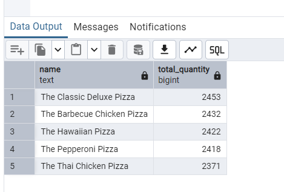
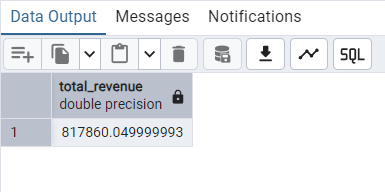
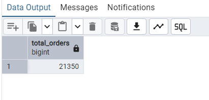

# Pizza Sales Analysis using SQL

## Overview
Analyzed pizza sales data using SQL to derive actionable business insights on sales performance and customer demand patterns.

## Dataset
- Orders  
- Order Details  
- Pizzas  
- Pizza Types  

## Key Analysis
- Identified top-selling and highest revenue-generating pizzas  
- Analyzed total orders and revenue trends  
- Examined sales distribution across categories and sizes  

## SQL Techniques
- JOIN operations  
- GROUP BY & aggregations  
- Filtering & sorting  

## Sample Outputs

### Top 5 Ordered Pizzas

### Total Revenue

### Total Orders

## Key Insights
- A few pizza types contribute majority of revenue  
- Larger size pizzas drive higher sales value  
- Demand peaks during specific time periods  
